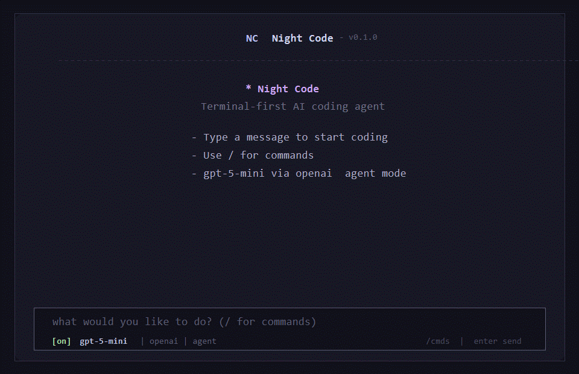

# Night Code

Terminal-first AI coding agent built with Bun workspaces, Hono, and Vercel AI SDK v7.



## Setup

Create a `.env` file in the workspace root:

```bash
OPENAI_API_KEY=sk-...
NIGHTCODE_PROVIDER=openai
NIGHTCODE_MODEL=gpt-5.5
NIGHTCODE_PORT=3000
```

Optional:

```bash
OPENAI_BASE_URL=
OPENAI_ORG_ID=
OPENAI_PROJECT_ID=
ANTHROPIC_API_KEY=
ANTHROPIC_AUTH_TOKEN=
ANTHROPIC_BASE_URL=
AZURE_OPENAI_API_KEY=
AZURE_OPENAI_RESOURCE_NAME=
AZURE_OPENAI_BASE_URL=
AZURE_OPENAI_API_VERSION=
AZURE_OPENAI_DEPLOYMENT=
NIGHTCODE_MAX_TOKENS=8192
NIGHTCODE_TEMPERATURE=0.2
NIGHTCODE_WORKSPACE=/path/to/project
NIGHTCODE_ALLOW_DANGEROUS_SHELL=false
NIGHTCODE_LOG_LEVEL=info
```

## Commands

```bash
bun install
bun run dev:server
bun run dev:cli
```

Run the CLI against another repository while keeping this source checkout as the app runtime:

```bash
bun run dev:cli -- --workspace /path/to/project
bun run dev:cli -- --cwd /path/to/project
NIGHTCODE_WORKSPACE=/path/to/project bun run dev:cli
```

Useful checks:

```bash
bun run check
bun run typecheck
bun run build
```

Code quality:

```bash
bun run format:check
bun run lint
bun run check:fix
```

This project uses Bun workspaces, Biome for formatting/linting, and the TypeScript 7 native preview compiler via `@typescript/native-preview`/`tsgo`.

## Backend

The server exports a fully typed Hono `AppType` from `@nightcode/server`, so the CLI can use `hc<AppType>()` for end-to-end route inference.

Routes:

- `GET /health`
- `GET /providers`
- `GET /models?provider=openai`
- `GET /models?provider=anthropic`
- `POST /chat` streams newline-delimited `LLMStreamChunk` JSON
- `POST /agents/coding/run`

## CLI workflow

Night Code includes slash commands for fast project work:

- `/plan`, `/fix`, `/review`, `/explain`, `/test` for agent workflow presets
- `/add <file>`, `/context`, `/clear-context` for pinned file context
- `/workspace <dir>` or `/cwd <dir>` to switch the active repository; this resets agent access, file context, skills, project instructions, and the repository map to the new workspace
- `/allow <dir>` to grant additional explicit access outside the active workspace
- `/index`, `/map` for a compact repository symbol map
- `/models`, `/model <id>`, `/provider <name>`, `/agent`, `/compact` for runtime control
- `/status`, `/stats`, `/cost`, `/doctor` for telemetry and health checks
- `/sessions`, `/resume <session-id>` to restore saved sessions, including their original workspace
- `/todo` to inspect the agent-maintained task plan
- `/agents` to inspect custom profiles from `.github/agents`, `.nightcode/agents`, or `.agents`
- `/lsp` to inspect LSP config from `.github/lsp.json`, `.nightcode/lsp.json`, or `~/.copilot/lsp-config.json`

Harness config in `.nightcode/config.yaml` can tune agent policy:

```yaml
maxAgentSteps: 8
maxRetries: 2
requirePlanForEdits: true
allowDangerousShell: false
disabledTools: []
allowedPaths: []
```

By default the shell tool blocks destructive command families such as recursive deletion, hard git resets, force git cleans, and disk formatting. Prefer targeted file tools for edits; set `allowDangerousShell: true` or `NIGHTCODE_ALLOW_DANGEROUS_SHELL=true` only for deliberately trusted runs.

Shared request and response schemas live in `@nightcode/shared`.

## Packages

- `packages/cli`: OpenTUI terminal interface.
- `packages/server`: Hono backend, LLM service, model router, agent service, logger, file watcher.
- `packages/shared`: Zod schemas, model catalog, shared types.
- `packages/database`: Drizzle/Bun SQLite schema and client.
