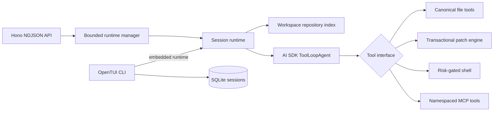

# Architecture

Night Code treats the harness—not only the model—as the product boundary.

## Runtime invariants

1. A runtime belongs to exactly one session and one canonical workspace.
2. A session has at most one active run.
3. UI notices never enter model context. Project instructions are loaded by the runtime from trusted, configured files.
4. All built-in filesystem tools pass through the same canonical boundary.
5. Mutations require a live task-plan item unless project policy explicitly disables that rule.
6. A structured patch validates every operation before the first write and rolls back an interrupted batch.
7. Tool approvals pause with the model's response messages intact, then resume through explicit approval-response parts.
8. Every streamed event has a run ID, monotonic sequence, and timestamp after `run-start` establishes event version 1.

## Context lifecycle

Repository indexes are keyed by normalized workspace root. Indexing records actual file modification times, excludes generated/vendor directories, and refreshes files after patch/write/edit/undo operations. Repository maps stay bounded by a token estimate.

Local compact mode does not pretend that substring truncation is a faithful summary. It emits an honest user-level context note, preserves recent messages, and instructs the agent to re-read state when missing history matters. Anthropic runs additionally enable native context editing and compaction.

## Transport and durability

The CLI defaults to an embedded runtime for zero-setup local use. The typed Hono client supports the same event contract over HTTP, including approval continuation and abort signals.

Conversation sessions are stored in `~/.nightcode/nightcode.db` (or `$NIGHTCODE_HOME/.nightcode/nightcode.db`) with WAL and atomic upserts. Old JSON sessions are imported once without deleting the source file.

## Research basis

The design follows several well-supported patterns:

- [OpenAI: the next evolution of the Agents SDK](https://openai.com/index/the-next-evolution-of-the-agents-sdk/) — controlled workspaces, native tools, checkpointing, and rehydration.
- [OpenAI: trustworthy third-party evaluations](https://openai.com/index/trustworthy-third-party-evaluations-foundations/) — report the model, harness, safeguards, budgets, and validity checks.
- [Vercel AI SDK agents](https://ai-sdk.dev/docs/agents/overview) and [tool approval](https://ai-sdk.dev/docs/ai-sdk-core/tools-and-tool-calling#tool-execution-approval) — explicit loop and approval primitives.
- [Vercel AI SDK MCP](https://ai-sdk.dev/docs/ai-sdk-core/mcp-tools) — HTTP/stdio clients and tool adaptation.
- [Anthropic context engineering](https://www.anthropic.com/engineering/effective-context-engineering-for-ai-agents) — high-signal, just-in-time context.
- [Anthropic long-running harness design](https://www.anthropic.com/engineering/harness-design-long-running-apps) — structured plans, handoffs, resets, and external evaluation.
- [SWE-agent ACI paper](https://arxiv.org/abs/2405.15793) — agent-computer interface design materially affects coding performance.
- [Aider repository maps](https://aider.chat/docs/repomap.html) — compact repository structure as navigation context.
